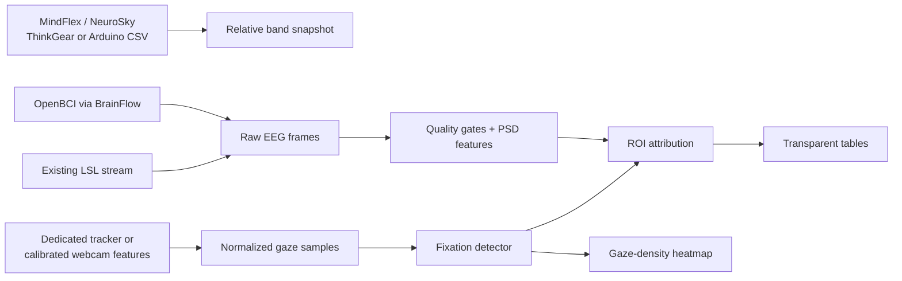

# PackScope

**PackScope** is a Python toolkit for transparent, quality-gated analysis of EEG and eye-tracking data in packaging and advertising research. It helps researchers compare label and ad variants using calibrated gaze, timestamped brain signals, and explicit uncertainty checks without overstating what the measurements can prove.

> PackScope is a local-first research utility. It does **not** diagnose, detect emotion, determine intent, measure attention, predict purchases, or prove that a packaging element caused a physiological response. Its outputs are descriptive, quality-gated inputs to a broader design-research workflow.

The project supports three distinct EEG input paths from the first commit:

| Input path | PackScope integration | What it provides | What it cannot provide |
| --- | --- | --- | --- |
| **MindFlex / NeuroSky / ThinkGear** | Direct pyserial source and independent documented packet parser | Poor signal, eSense fields, raw wave if emitted, relative device-derived bands | Bilateral F3/F4 alpha asymmetry or a validated psychological score |
| **MindFlex + Arduino Brain** | Strict decoder and pyserial source for the upstream `readCSV()` eleven-column output | Signal quality, Attention/Meditation fields, relative eight-band snapshots | Raw bilateral EEG; an Arduino bridge does not make the one-electrode device multichannel |
| **OpenBCI** | Optional BrainFlow source with explicit channel-to-electrode mapping | Timestamped raw multichannel EEG frames and PSD features; FAA only with both mapped F3 and F4 | Automatic electrode-location inference or universal data quality claims |
| **Existing LSL stream** | Optional LSL source with unambiguous discovery | Timestamped raw EEG frame for a declared channel schema | Guaranteed synchronization merely because the data arrived through LSL |

The gaze layer is equally explicit. It uses a top-left-origin normalized coordinate space, requires a recorded calibration, and can accept either an external dedicated tracker adapter or an optional MediaPipe webcam feature extractor. MediaPipe landmarks are input features—not validated gaze points—and are not turned into gaze coordinates until a display calibration has been fit.[1]

## Why this architecture

The supplied packaging article proposes a two-axis “emotional response” / “cognitive response” map and links it to eye tracking. That is a potentially useful **hypothesis-generation** pattern for comparing label treatments, artwork, claims, typography, and information hierarchy. It is not enough evidence to treat a beta/theta ratio, frontal alpha asymmetry (FAA), or a webcam landmark as a direct read-out of emotion, confusion, attention, or buying intent.

PackScope therefore keeps four things separate: device-derived bands, raw EEG signal features, calibrated gaze allocation, and hypothesis-only visualization labels. It will return a typed unavailable result rather than calculate FAA from a single MindFlex electrode, or splice gaze across invalid/dropped samples.

See [the architecture document](docs/ARCHITECTURE.md) for the data-flow diagram, contracts, hardware design, and extension rules. See [the validity and safety guide](docs/VALIDITY_AND_SAFETY.md) before collecting participant data.

## Architecture at a glance



## Quickstart

### Prerequisites

Install Python 3.11 or later. The default package requires only NumPy and SciPy. Device, webcam, LSL, reporting, and development dependencies are optional, which keeps a clean checkout usable without hardware or proprietary SDKs.

```bash
git clone https://github.com/your-org/packscope.git
cd packscope
python -m venv .venv
source .venv/bin/activate              # Windows: .venv\Scripts\activate
python -m pip install --upgrade pip
python -m pip install -e '.[dev,reporting]'
pytest
ruff check .
```

Install only the integrations required for a local experiment.

```bash
# Direct ThinkGear serial or Arduino Brain USB serial
python -m pip install -e '.[serial]'

# OpenBCI and other BrainFlow-supported boards
python -m pip install -e '.[brainflow]'

# Lab Streaming Layer; liblsl may also be required by the operating system
python -m pip install -e '.[lsl]'

# Experimental webcam landmark feature extraction
python -m pip install -e '.[webcam]'
```

### Decode an Arduino Brain line without hardware

The adapter accepts the documented `readCSV()` field order from the [kitschpatrol Brain Arduino library](https://github.com/kitschpatrol/Brain):

```bash
packscope decode-arduino-csv --line '0,51,40,1,2,3,4,5,6,7,8'
```

A successful result is JSON with `signal_quality`, `attention`, `meditation`, and the eight device-derived relative band values. In this upstream library, `0` is good signal and `200` is no signal. PackScope does not reinterpret Attention or Meditation as independently validated metrics.[2]

### Read a MindFlex Arduino bridge

Configure a user-owned Arduino sketch using the upstream Brain library to emit one `readCSV()` row per update. The default bridge baud rate is `9600`, matching the BrainGrapher example; pass a different baud rate if the sketch uses one.[3]

```bash
python examples/parse_mindflex_arduino.py --port /dev/ttyACM0 --baud 9600
```

For exact serial wiring and sketch setup, see [the Arduino bridge guide](examples/arduino_brain_csv/README.md). The Arduino Brain library is LGPL-3.0 and is **not** included, linked, or redistributed by PackScope; the PackScope adapter reads the plain serial output after it reaches the host.[2]

### Connect an OpenBCI Cyton for the FAA convention

First verify a stable hardware signal in the OpenBCI GUI, as OpenBCI recommends, then explicitly state which physical channels are mounted at F3 and F4. Cyton, Cyton+Daisy, and Ganglion have different channel/rate trade-offs documented by BrainFlow.[4] [5]

```bash
python examples/openbci_faa.py \
  --port /dev/ttyUSB0 \
  --f3-index 0 \
  --f4-index 1
```

The script returns `ln(alpha_power(F4)) - ln(alpha_power(F3))` only when both named channels are present and the window passes basic quality gates. It does not label that scalar “positive emotion,” “negative emotion,” or “engagement.”

## Minimal API examples

### Direct ThinkGear protocol parsing

```python
from packscope.devices import ThinkGearParser

parser = ThinkGearParser()
with open("captured-thinkgear.bin", "rb") as stream:
    for packet in parser.feed(stream.read()):
        snapshot = packet.as_band_snapshot(device_id="mindflex-a")
        if snapshot is not None:
            print(snapshot.signal_quality, snapshot.bands["theta"])
```

The finite-state parser validates packet length and checksum before exposing any values. It keeps documented `0xAA 0xAA` framing, unknown data rows, and malformed-packet recovery outside the rest of the analysis pipeline.[6]

### F3/F4 feature extraction with quality gating

```python
from packscope.analysis import frontal_alpha_asymmetry
from packscope.models import EegFrame

# frame must be raw, contemporaneous data with explicit F3 and F4 channel labels.
result = frontal_alpha_asymmetry(frame)
if result.value is None:
    print(f"Metric unavailable: {result.reason}")
else:
    print(f"FAA convention = {result.value:.4f}")
```

`MetricResult` always carries an availability status and reason. A one-channel ThinkGear/MindFlex path returns `insufficient_channels`; it will not produce a misleading asymmetry score.

### Calibrate webcam or tracker features to the packaging display

```python
import numpy as np
from packscope.gaze import AffineGazeCalibration

# Raw features might be left/right iris landmark x/y values or vendor coordinates.
# Targets are points rendered on the actual physical stimulus display.
features = np.array(
    [
        [0.12, 0.10, 0.18, 0.10],
        [0.82, 0.10, 0.88, 0.10],
        [0.12, 0.80, 0.18, 0.80],
        [0.82, 0.80, 0.88, 0.80],
        [0.47, 0.45, 0.53, 0.45],
    ]
)
targets = np.array([[0.1, 0.1], [0.9, 0.1], [0.1, 0.9], [0.9, 0.9], [0.5, 0.5]])
calibration = AffineGazeCalibration.fit(features, targets)
print(calibration.validation.percentile_95_error_norm)
```

Use five or nine targets, immediately validate against known display points, save the error summary, repeat drift checks, and treat a webcam result as exploratory unless it is validated for the operating conditions.[7]

### Attribute quality-gated windows to versioned label regions

```python
from packscope.analysis import attribute_metric_windows, detect_fixations
from packscope.reporting import NormalizedRect, RegionOfInterest

rois = [
    RegionOfInterest(
        roi_id="beer-name",
        label="Beer name",
        bounds=NormalizedRect(0.15, 0.10, 0.70, 0.18),
        stimulus_id="can-v3",
        version="1",
    )
]
fixations = detect_fixations(gaze_samples)
attributions = attribute_metric_windows(metric_windows, fixations, rois)
```

The attribution says only that a valid fixation's dwell time overlapped a metric window. It does not establish why a viewer looked at that region or what that metric “means.”

## Suggested homebrew packaging protocol

Start with a repeated-measures pilot: one participant sees two or more label/ad variants in counterbalanced order, with matched exposure time and predefined ROIs. Capture a quiet baseline before the packaging trials, calibrate/validate gaze against the actual screen, and retain quality exclusions. Compare **within-participant, baseline-relative** distributions across variants rather than using absolute universal cutoffs.[8]

| Study step | PackScope component | Required record |
| --- | --- | --- |
| Consent | `SessionConsent` | Pseudonymous participant code, consent document version, specific scopes |
| Stimulus preparation | `RegionOfInterest` | Image hash, stimulus version, ROI ID/version, display geometry |
| Device bring-up | Device source / CLI | Device model, source, sampling rate, channel map, serial or LSL settings |
| Gaze calibration | `AffineGazeCalibration` | Target set, validation error, calibration ID, drift checks, dropout |
| EEG acquisition | `EegFrame` | Montage/reference, units, raw/processed provenance, clock origin, quality flags |
| Analysis | `MetricResult`, `MetricWindow` | PSD band/window, baseline procedure, exclusion reasons, software version |
| Reporting | Heatmap + attribution table | Usable-trial count, missing data, uncertainty, descriptive—not diagnostic—language |

## Code structure

```text
src/packscope/
├── analysis/
│   ├── quality.py        # Transparent raw-EEG quality gates
│   ├── spectral.py       # Welch PSD, F3/F4 FAA convention, beta/theta ratio
│   ├── baseline.py       # Within-session robust normalization
│   ├── fixations.py      # Valid-sample I-DT fixation detector
│   └── attribution.py    # Temporal overlap between metric windows and ROIs
├── devices/
│   ├── thinkgear.py      # Independent documented ThinkGear packet parser
│   ├── thinkgear_serial.py
│   ├── arduino_csv.py    # kitschpatrol Brain readCSV decoder
│   ├── arduino_serial.py
│   ├── brainflow.py      # Optional OpenBCI / BrainFlow raw EEG source
│   └── lsl.py            # Optional LSL EEG source
├── gaze/
│   ├── base.py           # Display coordinate and source contracts
│   ├── calibration.py    # Affine feature-to-display calibration
│   ├── mediapipe.py      # Optional iris feature extraction, not gaze inference
│   └── quality.py
├── reporting/
│   ├── roi.py            # Versioned normalized packaging regions
│   └── heatmap.py        # Local gaze-density visualization
├── models.py             # Validated shared data contracts
├── privacy.py            # Consent scopes and atomic session manifest
└── errors.py             # Actionable domain exceptions
```

## Dependency and license policy

The repository and its original code are released under **Apache License 2.0**, selected because the project involves hardware integration and benefits from Apache’s explicit patent grant. It does not bundle a proprietary NeuroSky SDK, device firmware, participant recordings, or captured camera data. The direct ThinkGear decoder is independently written against the published protocol.[6]

Optional integrations have their own licenses and runtime/distribution obligations. BrainFlow is MIT-licensed but contains downstream distribution notices. `pylsl`, NumPy, SciPy, pyserial, MediaPipe, OpenCV, and Pillow must be reviewed in the version actually shipped. PyGaze is GPL-3.0, so it is intentionally not a dependency of this Apache-2.0 core; use it only through a separately reviewed integration or an external LSL bridge.[9] See [NOTICE](NOTICE) for current third-party pointers.

## Contributing

Read [CONTRIBUTING.md](CONTRIBUTING.md) before submitting changes. In particular, new adapters must state source provenance, units, timestamp origin, licences, hardware capabilities, and raw-versus-processed status. New signal metrics must state channel/montage requirements, quality gates, preprocessing, artifact policy, unavailable conditions, and interpretive limits. Every change needs offline tests; default tests must not require a device or contain participant data.

## License

Copyright 2026 PackScope contributors. Licensed under the [Apache License 2.0](LICENSE).

## References

[1]: https://developers.google.com/edge/mediapipe/solutions/vision/face_landmarker/python "MediaPipe Face Landmarker for Python"
[2]: https://github.com/kitschpatrol/Brain "kitschpatrol Brain Arduino Library"
[3]: https://github.com/kitschpatrol/brain-grapher "kitschpatrol BrainGrapher"
[4]: https://docs.openbci.com/ForDevelopers/SoftwareDevelopment/ "OpenBCI Software Development"
[5]: https://brainflow.readthedocs.io/en/stable/SupportedBoards.html "BrainFlow Supported Boards"
[6]: https://developer.neurosky.com/docs/doku.php?id=thinkgear_communications_protocol "ThinkGear Communications Protocol"
[7]: https://pmc.ncbi.nlm.nih.gov/articles/PMC11225961/ "Guidelines for minimum reporting of eye-tracking studies"
[8]: https://pmc.ncbi.nlm.nih.gov/articles/PMC10794660/ "Challenges in EEG-based emotion recognition"
[9]: https://github.com/esdalmaijer/PyGaze "PyGaze Source Repository"
