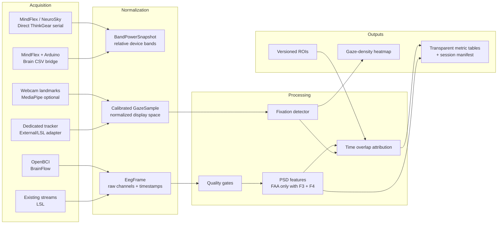
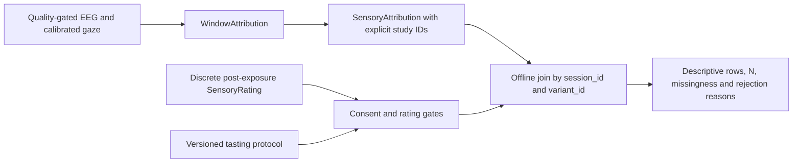

<!-- SPDX-License-Identifier: Apache-2.0 -->
# PackScope Architecture

> **Status:** initial reference implementation. PackScope is an exploratory, local-first research utility. It does not diagnose, detect emotion, determine purchase intent, or establish causal responses to packaging.

## Design decision

PackScope separates **device transport**, **measurement processing**, **gaze-space calibration**, **time-window attribution**, and **reporting**. This boundary is essential because a MindFlex reading, webcam face landmarks, and multichannel OpenBCI samples have materially different provenance and validity. The package retains that distinction in types and refuses unavailable calculations rather than fabricating a common score.



## Data contracts

| Contract | Produced by | Key properties | Deliberately not claimed |
| --- | --- | --- | --- |
| `BandPowerSnapshot` | Arduino Brain CSV and ThinkGear serial adapters | Device-derived relative bands, poor-signal value, eSense fields, host receipt time | Raw bilateral EEG, F3/F4 asymmetry, a universal focus score |
| `EegFrame` | BrainFlow and LSL adapters | Raw channels × samples, timestamps, explicit channel labels, sample rate and provenance | A common voltage unit without device metadata; inferred electrode locations |
| `GazeSample` | A calibrated source | Validity flag, top-left-origin normalized display coordinate, calibration ID | Dedicated-tracker accuracy from a webcam feature alone |
| `MetricResult` | Signal-processing functions | Value or typed reason for unavailability, processing details | Emotion, diagnosis, intent, or causal attribution |
| `WindowAttribution` | Multimodal join | Fixation dwell overlapping a metric window by ROI | Evidence that an ROI caused the metric change |

## Hardware adapters

### MindFlex, Arduino Brain, and NeuroSky / ThinkGear

The direct ThinkGear adapter implements an independent finite-state parser for the documented `0xAA 0xAA`, payload-length, payload, checksum framing. It decodes poor signal, Attention, Meditation, raw wave, and both documented eight-band payload formats. Unknown data rows are skipped safely for protocol forward compatibility. The `ThinkGearSerialSource` is a pyserial transport wrapper for a direct headset modification or Bluetooth serial bridge.[1]

The Arduino path is specifically compatible with the `readCSV()` output documented by the **kitschpatrol Brain** Arduino library: `signal strength, attention, meditation, delta, theta, low alpha, high alpha, low beta, high beta, low gamma, high gamma`. The `ArduinoBrainCsvDecoder` and `ArduinoBrainSerialSource` parse those exact eleven fields. Its default USB baud rate is `9600`, matching the BrainGrapher example, but this should be changed to match the user's sketch.[2] [3]

Both MindFlex paths expose a single-channel device's *relative* band values. They do not return bilateral frontal channels, and PackScope therefore returns `insufficient_channels` rather than calculating frontal alpha asymmetry (FAA). Attention and Meditation are retained only as device-provided eSense fields. The software does not relabel them as independently validated measures.

### OpenBCI and BrainFlow

`BrainFlowEegSource` uses lazy imports and supplies `EegFrame` blocks only after callers have explicitly mapped channel indices to electrode labels. A configuration cannot accidentally call `EEG_0` “F3.” This supports OpenBCI Cyton, Cyton+Daisy, Ganglion, and other boards documented by BrainFlow, subject to their own connection settings. OpenBCI currently points Python integrations to BrainFlow and recommends verifying signals in its GUI before direct integration.[4] [5]

A practical FAA-capable start is Cyton with an electrode montage that explicitly labels both `F3` and `F4`. Cyton provides eight channels at 250 Hz; Cyton+Daisy increases channel count but has a documented 125 Hz sampling-rate tradeoff; Ganglion provides four channels at 200 Hz. The exact electrode placement, reference, sampling rate, and hardware quality must be recorded for every session.[5]

### Lab Streaming Layer

`LslEegSource` is an optional bridge for acquisition systems already exposing a unique LSL EEG stream. It does not make synchronization promises merely because LSL is present. Stream identity, timestamp origin, channel schema, and clock-correction procedure must be persisted alongside the recording. For high-value studies, record raw LSL streams into an interoperable archival format and conduct final clock correction offline.[6]

### Eye tracking

PackScope defines only one gaze coordinate space: normalized `[0, 1] × [0, 1]`, with origin at the physical display’s top-left. A source must provide calibration provenance. `AffineGazeCalibration` maps an arbitrary source feature vector to that coordinate system using at least five paired measurements and reports validation error in normalized display units.

The optional MediaPipe component extracts iris-center *features* from a compatible Face Landmarker model. It does not claim that facial landmarks are gaze points. Webcam use therefore requires a per-session calibration and validation procedure, and its outputs should be treated as exploratory area-of-interest estimates.[7]

PyGaze remains a viable integration option for a separately distributed, GPL-compatible connector or for an LSL bridge from a dedicated tracker. It is deliberately **not** a PackScope dependency because PyGaze is GPL-3.0, whereas this repository is Apache-2.0.[8] The open core avoids importing, packaging, or distributing PyGaze.

## Measurement pipeline

The raw-EEG pipeline runs quality checks before it estimates power spectral density (PSD) by Welch’s method. Quality gates flag short windows, flatlined channels, long timestamp gaps, predeclared source flags, and optional amplitude limits. These checks are intentionally conservative and do not prove that a retained signal is neural rather than ocular, muscle, or motion artifact.

`frontal_alpha_asymmetry()` uses the declared convention `ln(alpha_power(F4)) − ln(alpha_power(F3))`. It requires both channels, the same quality-passed window, finite positive powers, and explicit channel labels. `beta_to_theta_power_ratio()` is named as a signal-derived spectral ratio rather than “cognitive load.” Both functions return a typed unavailable result rather than attempting an imputed value.

A simple I-DT fixation detector operates on contiguous valid gaze samples. It neither spans invalid samples nor bridges long time gaps. `attribute_metric_windows()` then measures only the temporal overlap between each fixation and each spectral window, assigning dwell time to a versioned region of interest (ROI). The output is a descriptive co-occurrence measure, not evidence of causal neural or emotional effect.

## Session and privacy model

`SessionConsent` is an affirmative, pseudonymous consent record with independent scope flags for raw EEG, gaze coordinates, camera video, derived metrics, and aggregate exports. A capture process should check the needed scope before it begins. `SessionManifest` writes stimulus hash, consent version, software version, and local-session provenance atomically. It does not itself collect name, email, face image, or cloud identifier.

Raw EEG, gaze traces, and camera video can be sensitive. PackScope is intentionally local-first. A production study application should encrypt retained data, define retention and deletion procedures, keep consent revocable, and avoid using outputs for employment, insurance, eligibility, safety-critical, or other high-impact decisions.[9]

## Repository layout

```text
packscope/
├── src/packscope/
│   ├── analysis/             # Quality gates, PSD features, baseline, fixation, attribution
│   ├── devices/              # Arduino CSV, ThinkGear serial/parser, BrainFlow, LSL
│   ├── gaze/                 # Display geometry, calibration, MediaPipe feature extraction
│   ├── reporting/            # ROIs and gaze-density heatmap renderer
│   ├── models.py             # Validated shared contracts
│   ├── privacy.py            # Consent and atomic session-manifest support
│   └── errors.py             # Actionable domain exceptions
├── tests/                    # Offline unit tests; no hardware required
├── examples/                 # User-operated acquisition and processing snippets
├── docs/                     # Architecture and validity guidance
├── pyproject.toml            # Extras keep device stacks optional
├── LICENSE                   # Apache-2.0
└── README.md                 # Quickstart and contribution guide
```

## Extension rules

| Change | Correct location | Required guardrail |
| --- | --- | --- |
| New headset transport | `devices/` | Preserve raw versus device-derived provenance; lazy-import optional dependencies |
| New eye tracker | `gaze/` | Document coordinate origin, calibration, validation error, and drift policy |
| New EEG feature | `analysis/` | Return `MetricResult`; declare channels, band/window, quality and artifact policy |
| New packaging element | `reporting/roi.py` | Give it stable ID, stimulus ID, semantic label, and version |
| New visual output | `reporting/` | Avoid color schemes that imply a mental-state diagnosis or causal conclusion |

## References

[1]: https://developer.neurosky.com/docs/doku.php?id=thinkgear_communications_protocol "ThinkGear Communications Protocol"
[2]: https://github.com/kitschpatrol/Brain "kitschpatrol Brain Arduino Library"
[3]: https://github.com/kitschpatrol/brain-grapher "kitschpatrol BrainGrapher"
[4]: https://docs.openbci.com/ForDevelopers/SoftwareDevelopment/ "OpenBCI Software Development"
[5]: https://brainflow.readthedocs.io/en/stable/SupportedBoards.html "BrainFlow Supported Boards"
[6]: https://labstreaminglayer.readthedocs.io/info/time_synchronization.html "Lab Streaming Layer Time Synchronization"
[7]: https://developers.google.com/edge/mediapipe/solutions/vision/face_landmarker/python "MediaPipe Face Landmarker for Python"
[8]: https://github.com/esdalmaijer/PyGaze "PyGaze Source Repository"
[9]: https://www.unesco.org/en/legal-affairs/recommendation-ethics-neurotechnology "UNESCO Recommendation on the Ethics of Neurotechnology"

## Post-exposure sensory records and offline joins

`sensory.models.SensoryRating` records self-reported hedonic ratings, named intensity
ratings, optional preference ranks, and separately consented notes. The frozen
contract validates identifiers and scale types. Hedonic scores are integers 1–9;
`None` means missing. This implementation declares intensity scales as **0–10**
(0 absent, 10 maximum), with finite values only. Preference ranks are positive
integers; ties are not supported within a session/protocol ranking set. Missing
optional intensity or rank fields are retained without imputation. Dictionaries
and lists are defensively copied, and the gate revalidates them before use.

`TastingProtocolMetadata` requires a version, explicit `BlindingType.DOUBLE_BLIND`,
`SINGLE_BLIND`, or `OPEN`, washout duration, serving temperature, and counterbalancing
status. These fields record the declared protocol; they do not certify its execution
or establish universal temperature/washout thresholds.

`SessionConsent` remains defined in `privacy.py` and is also available from
`models.py`. Existing four-argument initializers remain valid and default to no
sensory permissions. `allow_sensory_ratings` and `allow_sensory_freetext` are separate
boolean permissions. `SessionConsent.create()` accepts these keyword arguments or
explicit `ConsentScope.SENSORY_RATINGS` / `SENSORY_FREETEXT` grants. Constructors and
`dataclasses.replace()` treat the boolean fields as authoritative and synchronize
the named scopes, so setting a flag to false revokes that permission. Manifest JSON
retains both booleans and scopes; conflicting envelope provenance is rejected.
Free-text permission alone does not authorize ratings. Collection applications must
check permissions **before capture**; analysis gates cannot undo unauthorized storage.

`evaluate_sensory_quality()` returns `MetricResult[SensoryRating]`. Missing consent,
missing protocol, missing hedonic scores, and quality-flagged ratings return
`MetricStatus.UNAVAILABLE`, `value=None`, and a `MetricReason`. Any supplied notes
require free-text consent. The result wrapper now accepts structured dataclass
payloads as well as numeric metrics, recursively rejecting non-finite numeric fields.
Existing EEG status values and numeric behavior remain available. The version-one
JSON serializer supports numeric and explicitly tagged artifact-path `MetricResult` payloads; it
explicitly rejects structured results rather than exporting an unreadable schema.



`analysis.sensory_join.SensoryAttribution` adds explicit session, variant, stimulus,
and product identity to an existing `WindowAttribution`. `variant_id` must identify
an immutable visual-stimulus version in the study manifest; changing the visual
requires a new variant ID. The join verifies stimulus/product agreement and never
infers IDs from timestamps or ROI names. Retain the stimulus hash, ROI versions,
and acquisition provenance in the originating session manifest.

`join_attributions_with_sensory()` accepts these context records, ratings,
per-session consents, and protocols keyed by `(session_id, variant_id)`. It performs
a full outer join on that pair. Ratings use timezone-aware wall-clock timestamps;
EEG/gaze use their acquisition clock. Ratings may occur long after exposure, with
no nearest-time match, resampling, interpolation, or forced real-time alignment.
Each variant is one tasting per session; repeat tastings need distinct session IDs.
Duplicate rating IDs, multiple ratings per join key, tied ranks within a
session/protocol, and stimulus/product conflicts are explicitly rejected.

Rows contain gated hedonic scores, independent gaze dwell, original window EEG
results, protocol metadata, and consent scopes. Free-text notes are excluded from
summary tables. Exact repeated exposure intervals across different metrics count
once toward dwell; conflicting or partially overlapping intervals make aggregate
dwell unavailable instead of double-counting it. EEG failures remain visible and
do not erase a valid self-report or valid gaze dwell.

`summary.n` counts session/variant pairs with available hedonic and gaze data;
`n_eeg_pairs` additionally requires an available EEG metric. Neither counts EEG
windows as participants or asserts independence of repeated participant sessions.
Missing rating records, missing required hedonic scores, absent attributions,
rejected rating rows, and rejected EEG windows have separate counts. Reason counts
count unavailable measurements, so one row can contribute multiple reasons.
An available summary means the descriptive table exists, even if `n=0`; each
unavailable measurement still has `value=None`. Empty inputs return an unavailable
join result. The join does not pool protocols or fit correlations or predictions.

An offline fixture exercises the complete path without new dependencies:

```python
from packscope.analysis.sensory_join import join_attributions_with_sensory
from packscope.testing.synthetic import generate_synthetic_sensory_ratings

fixture = generate_synthetic_sensory_ratings(session_count=3)
result = join_attributions_with_sensory(
    fixture.attributions, fixture.ratings,
    consents=fixture.consents, protocols=fixture.protocols,
)
print(result.value.n)  # Six synthetic session/variant observations
```

Fixtures contain paired raw EEG/gaze streams and explicitly simulated protocol and
consent records. Synthetic self-report scores are generated independently of EEG
noise and gaze allocation; they are not neural estimates. Study designs comparing
packaging expectation and sensory experience must retain those as separately
identified conditions and questionnaires; this module does not infer or subtract
an undeclared expectation score from a taste rating.
