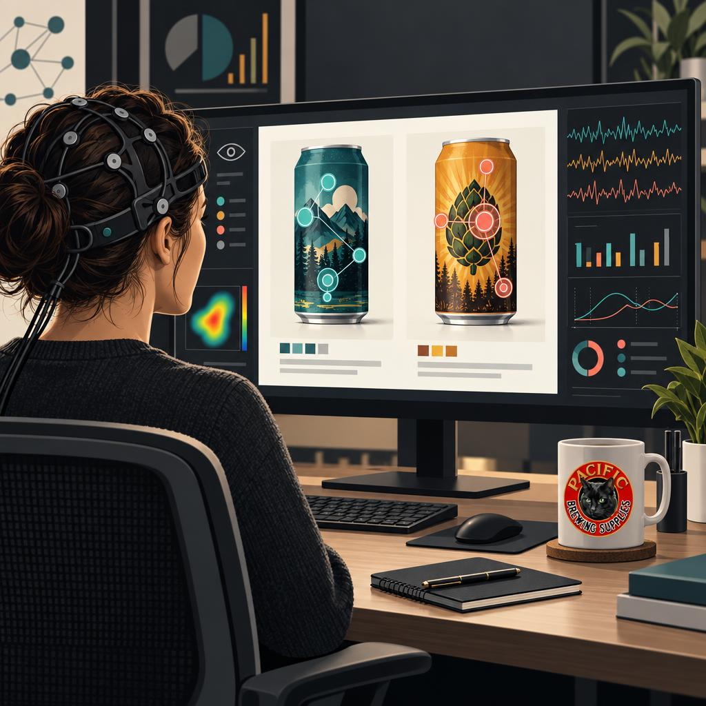
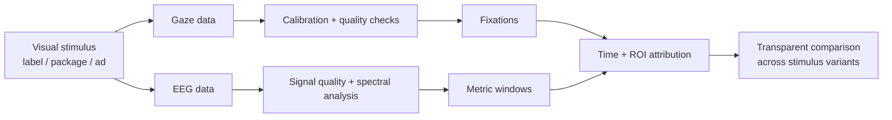
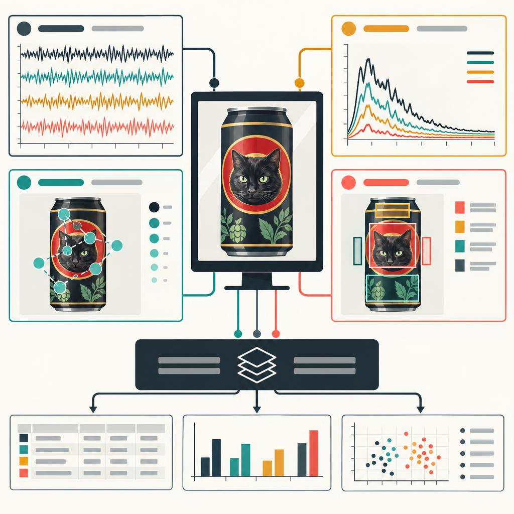
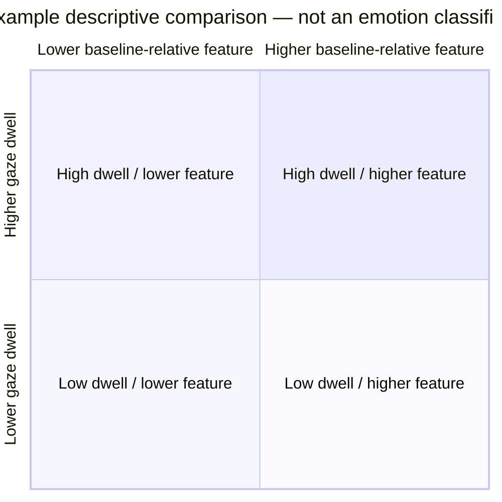
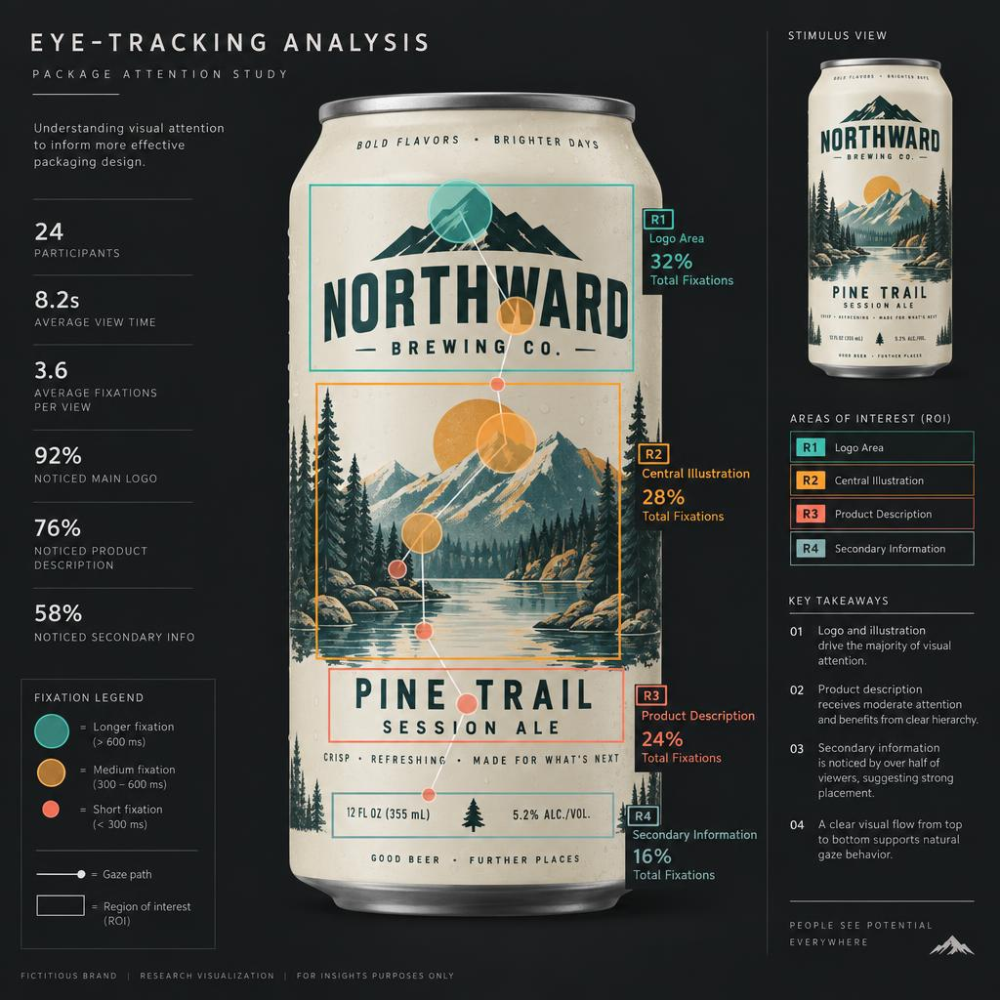
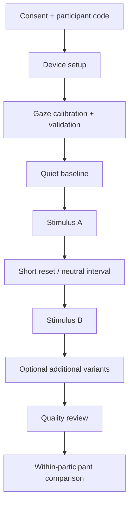
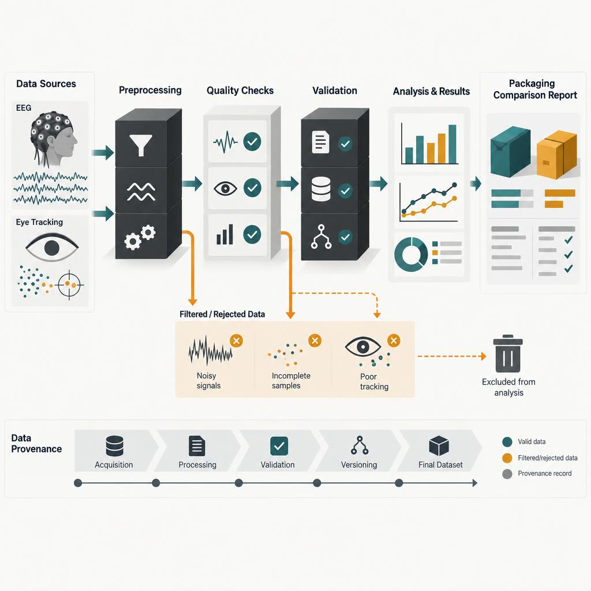
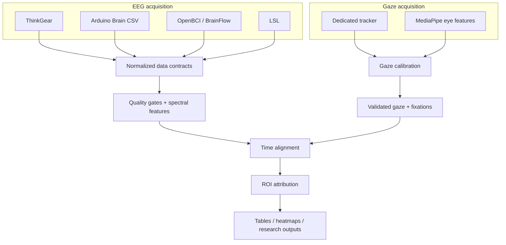

# PackScope: Seeing What the Data Can — and Cannot — Tell Us

**A practical toolkit for combining EEG, eye tracking, and packaging research without pretending the measurements say more than they do.**

PackScope grew out of a simple question: if eye tracking can tell us where someone looked, and EEG can tell us something about what was happening in the recorded signal at the same moment, can the two be combined in a useful way for packaging and advertising research?

The answer is **yes — with some important limits**.

PackScope is a local-first Python toolkit for collecting, aligning, quality-checking, and analyzing gaze and EEG data around versioned visual stimuli such as labels, packages, ads, and other design treatments. It is designed to make useful comparisons between variants while preserving provenance, uncertainty, and the distinction between **what was measured** and **what we think it might mean**.

Historically, this kind of combined eye-tracking and EEG research has largely lived in the world of **large consumer brands, specialized market-research and neuromarketing firms, and well-equipped academic or corporate labs**—organizations with the budgets for dedicated hardware, proprietary analysis platforms, and commissioned studies. PackScope explores what happens when some of those tools and methods are made accessible to **homebrewers, small breweries, independent package designers, and curious makers** using open software and comparatively approachable hardware. It is not intended to turn a hobbyist setup into a commercial neuroscience laboratory; the goal is to make careful, useful experimentation possible without hiding the limitations of the equipment or the evidence.

> **PackScope does not read minds.** It does not diagnose emotion, determine intent, predict purchases, or prove that a package element caused a neurological response. Its purpose is to provide transparent, quality-gated evidence that can be used alongside traditional design research.



*PackScope combines visual-stimulus research with time-aligned EEG and gaze measurements while keeping interpretation separate from observation.*

---

## The Idea

Traditional packaging research can answer many useful questions directly:

- Which package did a participant choose?
- Which claim did they remember?
- Which design was easier to find on a shelf?
- Which version did they say they preferred?

Eye tracking adds another dimension: **where did they actually look, and for how long?**

EEG can add a second stream of time-aligned physiological data. Depending on the hardware, that may include raw multi-channel brainwave recordings, spectral power estimates, device-derived band values, or proprietary fields such as NeuroSky's Attention and Meditation outputs.

PackScope's job is not to turn those measurements into a single magic score. Instead, it keeps the layers separate and lets a researcher ask better questions.



---

## What We Measure

It is tempting to reduce physiological and gaze measurements to simple axes such as "emotional response" or "cognitive response." Visualizations like that can be useful for generating hypotheses, but PackScope deliberately avoids treating broad psychological labels as directly measurable facts.

Instead, PackScope works with observable or explicitly derived quantities.



*The useful inputs are kept distinct: recorded signals, derived features, calibrated gaze, and versioned regions of interest. None is automatically translated into an emotion or intent.*

| Layer | Examples | What it can support | What it does **not** establish |
| --- | --- | --- | --- |
| **Gaze** | calibrated x/y position, fixation duration, ROI dwell time | what part of the stimulus was visually examined | why the participant looked there |
| **EEG signal** | raw channels, PSD, alpha/beta/theta power | changes in recorded neural signal features | a specific emotion or purchase intention |
| **Device-derived metrics** | ThinkGear Attention, Meditation, relative bands | comparison of the device's own outputs | independently validated attention or calmness |
| **Combined attribution** | fixation overlaps a valid EEG metric window | what was being viewed when a signal feature occurred | causation between the viewed element and the signal |

### A safer replacement for the "emotion quadrant"

Rather than labeling quadrants as *Confusion*, *Interest*, *Easy Enjoyment*, or *Unengaged*, PackScope favors a descriptive comparison space.



The labels stay deliberately neutral. Interpretation belongs in the research context, not in the measurement pipeline.

---

## Getting the Data

PackScope supports several EEG acquisition paths because the available hardware can vary dramatically in capability.

### MindFlex / NeuroSky / ThinkGear

A MindFlex-class device can provide signal-quality information, proprietary eSense outputs, relative band snapshots, and — on some paths — raw samples. It is inexpensive and useful for experimentation, but it is still a single-electrode consumer device.

That matters. A single electrode cannot be treated like a multi-channel research EEG system, and it cannot provide bilateral measurements such as F3/F4 frontal alpha asymmetry.

### MindFlex + Arduino Brain

PackScope can also consume the common Arduino Brain CSV stream. This is useful for inexpensive experimental setups and provides a straightforward serial path into the toolkit.

The Arduino bridge does not add electrodes or increase what the headset itself measures. It simply provides another way to obtain the device output.

### OpenBCI / BrainFlow

With explicitly mapped channels, OpenBCI hardware provides raw multi-channel EEG data suitable for spectral analysis and metrics that actually require multiple electrodes.

For example, PackScope can compute the convention:

```text
ln(alpha power F4) - ln(alpha power F3)
```

—but only when both F3 and F4 are explicitly present and the data window passes the required quality checks.

### Existing LSL streams

PackScope can also consume a declared Lab Streaming Layer EEG stream, allowing it to participate in larger experimental setups without owning every device integration itself.

---

## Eye Tracking: Knowing What Was on Screen

EEG alone does not tell us what a participant was looking at.

The gaze side of PackScope uses a normalized coordinate system tied to the actual displayed stimulus. A dedicated eye tracker can provide gaze data directly through an adapter. An experimental webcam path can instead extract eye/iris features with MediaPipe, but those features do not become valid gaze coordinates until they have been calibrated against known positions on the display.

A typical calibration uses five or nine known points:

```text
●-----------------------●
|                       |
|          ●            |
|                       |
●-----------------------●
```

PackScope records the calibration and its error rather than assuming that a detected iris position automatically equals a point on screen.

> **Optional future figure:** A monitor showing a nine-point calibration grid with eye features mapped to screen coordinates. A small inset could emphasize that calibration error is recorded rather than hidden.

---

## From a Package to Regions of Interest

A package image can be divided into versioned **regions of interest (ROIs)** before a study begins.

For a beer label, for example:

```text
┌──────────────────────────────────────┐
│             BRAND / LOGO             │
│                                      │
│             BEER NAME                │
│                                      │
│          [ central artwork ]         │
│                                      │
│  STYLE          ABV          VOLUME  │
└──────────────────────────────────────┘
```

Possible ROIs might include:

- brand mark
- beer name
- illustration
- style descriptor
- ABV
- package claim
- required regulatory copy

Each ROI belongs to a specific stimulus and version. That prevents later analysis from quietly assuming that an area meant the same thing after a label changed.



*An ROI view turns a package into a versioned research stimulus: gaze can be attributed to defined areas without claiming why the participant looked there.*

---

## What Happens During a Study

A simple PackScope packaging study can use repeated measures: the same participant views two or more label variants in counterbalanced order.



For each trial, PackScope can retain:

- stimulus identity and file hash
- stimulus version
- ROI definitions
- device and channel configuration
- gaze calibration record and error
- EEG sampling details
- timestamps and clock origin
- fixation data
- metric windows
- exclusions and quality failures
- software/version provenance

This is intentionally more tedious than producing a single score. The extra context is what makes later results interpretable.

---

## Linking Gaze and EEG

The interesting part happens when the two streams are aligned in time.

Suppose a participant fixates on a beer name from 8.4 to 9.1 seconds. PackScope can examine which **valid** EEG-derived metric windows overlap that fixation.

```text
Time →       8.0        8.5        9.0        9.5

Gaze       ───────[ BEER NAME FIXATION ]────────

EEG metric     [window A] [window B] [window C]
                  ✓          ✓          ✕
```

That produces a defensible statement such as:

> During a valid fixation on the beer-name ROI, the participant's baseline-relative alpha-band feature differed from the corresponding window in the alternate design.

It does **not** justify:

> The beer name made the participant feel happier.

That distinction is central to PackScope.

---

## Quality Gates Matter More Than a Pretty Graph

Physiological data are noisy. PackScope therefore treats a metric being **unavailable** as a legitimate result.

Examples include:

- insufficient EEG channels
- missing F3 or F4 for a bilateral metric
- invalid or dropped samples
- poor signal quality
- failed gaze calibration
- excessive gaze dropout
- unsupported hardware capability
- a metric window that does not overlap valid data

Rather than manufacture a number, PackScope returns a typed unavailable result with a reason.

```python
result = frontal_alpha_asymmetry(frame)

if result.value is None:
    print(result.reason)
else:
    print(result.value)
```

For research tooling, **"we cannot calculate this from these data" is often the correct answer.**



*PackScope treats validation as part of the analysis. Data that do not meet calibration, channel, or signal-quality requirements are excluded rather than forced into a result.*

---

## A Packaging Example

Imagine three proposed labels for the same beer:


*Even simple A/B comparisons can isolate meaningful differences in hierarchy, artwork, and information placement before extending the study to additional variants.*

- **A:** large illustration, small style name
- **B:** large beer name, simplified artwork
- **C:** stronger brewery branding with more secondary copy

A PackScope pilot could ask descriptive questions such as:

1. Which ROIs received the longest dwell time?
2. How quickly was the beer name fixated?
3. Was required information actually viewed?
4. Were differences consistent across participants or driven by one subject?
5. Did baseline-relative EEG features differ during comparable ROI fixations?
6. How much usable data remained after quality exclusions?

Those results can then be considered together with preference surveys, recall, shelf-search performance, interviews, or actual choice behavior.

The goal is not to replace those methods. It is to add another carefully documented layer of evidence.

---

## Why PackScope Is Deliberately Conservative

Neuromarketing is attractive partly because it seems to promise access to reactions that people cannot or will not verbalize. That makes it especially easy to overstate what a signal means.

PackScope takes the opposite approach.

It separates:

1. **device output** — what the hardware actually produced;
2. **derived signal features** — what was mathematically calculated;
3. **gaze behavior** — where calibrated gaze was assigned;
4. **attribution** — which valid measurements overlapped in time;
5. **interpretation** — the research hypothesis applied afterward.

That separation makes the software less magical, but much more useful for reproducible work.

---

## Architecture at a Glance



---

## What PackScope Is — and Is Not

### It is

- a transparent analysis toolkit
- a way to combine gaze and EEG timelines
- a framework for versioned visual stimuli and ROIs
- a place to enforce calibration and signal-quality requirements
- a way to compare variants using descriptive measurements
- an experimental platform for packaging and advertising research

### It is not

- an emotion detector
- a lie detector
- a medical or diagnostic system
- a purchase predictor
- an automatic measure of attention
- proof that one visual element caused a physiological change

---

## The Useful Question Is Usually "What Changed?"

The strongest use of PackScope is not trying to assign an absolute psychological meaning to a number.

It is asking controlled comparative questions:

> When the same person viewed two versions of the same package under the same conditions, what changed in where they looked, how long they looked there, and in the quality-gated physiological features recorded during those moments?

That is a narrower question than "How did this package make them feel?"

It is also a question the data have a much better chance of answering.

---

## Further Reading

For implementation details, see:

- [`README.md`](../README.md) — installation, device integrations, examples, and API usage
- [`docs/ARCHITECTURE.md`](ARCHITECTURE.md) — data flow and internal contracts
- [`docs/VALIDITY_AND_SAFETY.md`](VALIDITY_AND_SAFETY.md) — interpretation limits, research validity, and participant considerations

PackScope is released under the Apache License 2.0.
